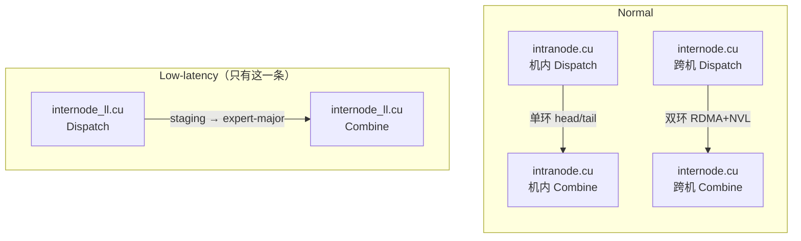
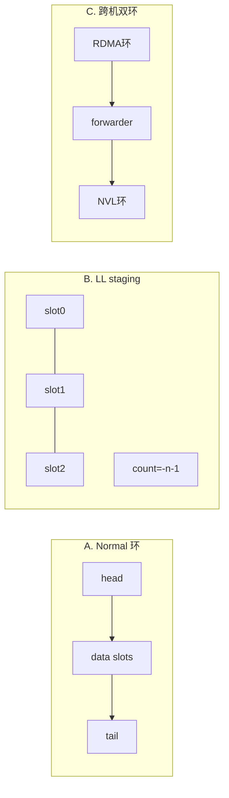
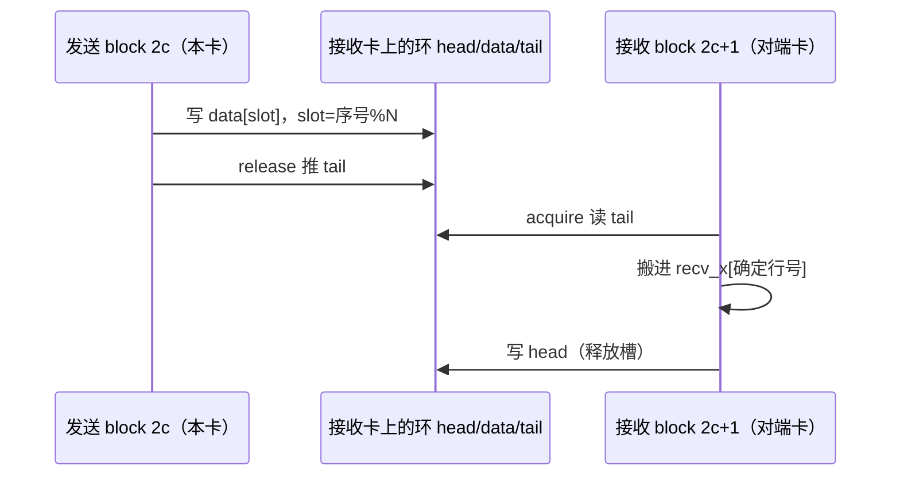
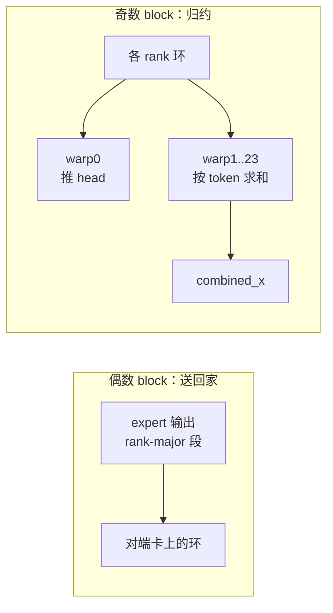
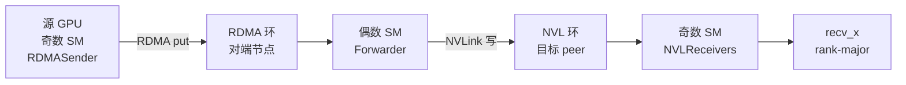
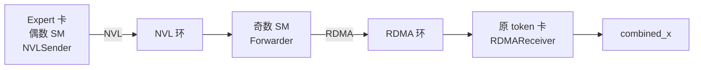
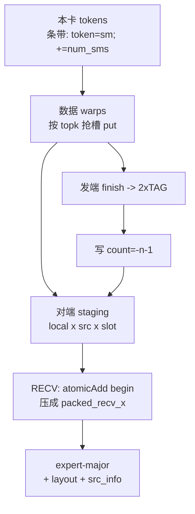
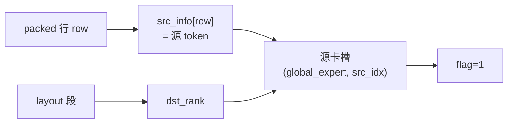

# DeepEP V1：Normal / Low-latency × Dispatch / Combine × Intranode / Internode —— Warp·Block·队列对照

> 承接 [10](./10-deepep-v1-intranode-dispatch-kernel.md)–[14](./14-deepep-v1-low-latency-combine-and-pack.md)。本文用**图 + 表 + 具体数字**把三件事钉死：
>
> 1. **发送**侧 block / warp：谁负责什么
> 2. **中转**队列：环形 head/tail vs 定容 staging（**不是链表**）
> 3. **接收**侧 block / warp：谁负责什么
>
> 代码：`csrc/kernels/legacy/intranode.cu`、`internode.cu`、`internode_ll.cu`；`LEGACY_NUM_MAX_NVL_PEERS=8`。

```text
本次讲解位置
章节：communication / DeepEP V1
小节：SM / warp / 队列三维对照（图文版）
知识点：偶发奇收 × 单环；跨机双环 + forwarder；LL 无 channel、staging+门铃；中转数据模型（head/tail 所有权）
上次：LL combine 打包回程（14）
下次：跨机 WarpRole 走读（16）→ 深挖问答（17）
PTX / 原语：st.release.sys / ld.acquire.sys、bar.sync、atomicAdd、ibgda put、grid.sync
```

## 为什么现在讲这个

精读单条路径时「这段代码懂了」，一换路径就懵——因为**坐标系变了**：

| 误读 | 正确 |
|---|---|
| LL 也有 channel 偶数发奇数收 | LL **没有** channel；同 grid 先 SEND 再 RECV |
| head/tail = 链表 next | **单调计数器 + 环形槽** `slot = idx % N` |
| internode ≈ intranode | 多一层 **RDMA 环 → NVL 环 + forwarder** |
| combine ≈ dispatch 的 warp 切法 | 机内 combine 轮转 dst / warp0 专推 head |

下面每条路径都按同一模板画三张图：**发谁 → 中转长什么样 → 收谁**。

---

## 0. 地图：先认路，再进细节

### 0.1 六条主路径（没有「LL 机内」）



```text
                    +------------ Normal ------------+     +---- Low-latency ----+
                    |  intranode.cu    internode.cu  |     |  internode_ll.cu    |
  Dispatch          |  机内 NVLink      RDMA+NVL     |     |  直连 RDMA（定容）  |
  Combine           |  机内 NVLink      RDMA+NVL     |     |  直连 RDMA（定容）  |
  中转长什么样      |  每(ch,rank)一环   双层环      |     |  数组 + 门铃        |
  最终布局          |  rank-major                    |     |  expert-major       |
```

### 0.2 三种中转，一眼分清

```text
【A】Normal 环形队列（不是链表！）         【B】LL staging 定容数组

     已消费 <-- head                          slot:  0    1    2    3
        +--+--+--+--+--+--+                     +----+----+----+----+
        |  |##|##|##|  |  |  <- 占用段         | t5 | t1 | t9 |    |  一次填满
        +--+--+--+--+--+--+                     +----+----+----+----+
              ^-----^                           门铃: count = -n-1
            head   tail                         不回收；slot != 源 token

  slot = 序号 % N；满了等 head 前进
  只有两个计数器，没有 next 指针


【C】Normal 跨机 = 两层环串起来

  源卡 --put--> [RDMA 环] --forwarder--> [NVL 环] --> 目标卡 recv_x
```



### 0.2.1 中转数据模型（对照表，细节见 16/17）

读路径前先认清四件事：**槽里放什么、谁推 tail、谁推 head、回家靠什么线索**。

#### A. Normal 单环（机内）不变量

```text
逻辑序号单调：head / tail 只增不减
物理槽位：    slot = 序号 % N
占用长度：    occupied = tail - head
生产者：写 data[slot] → release/推 tail
消费者：acquire 读 tail → 搬 [head,tail) → 写 head（或 Coord 取 min 再写）
```

| 字段 | 含义 |
|---|---|
| `data[N]` | 定长槽：hidden + 元数据（src / topk / scales…） |
| `head` / `tail` | 单调计数器，**不是**链表 next |
| `send_head[token][dst]` | 旁路线索：本 channel 内序号，或 `-1` 表示没发 |

#### B. Normal 跨机双环（数据结构）

```text
RDMA 层（SymBuffer，NVSHMEM 对称堆）
  send_half[dst_rdma][channel][slot]   本卡装箱区
  recv_half[src_rdma][channel][slot]   对端 put 进来（槽序号镜像）
  + meta[18]（每 channel 一次）+ head + tail

NVL 层（AsymBuffer，IPC）
  peer 上的环：data / head / tail / prefix
  combine 时再按「RDMA 来源」拆成 R 段子环（防死锁）
```

| 指针 | 谁写（dispatch） | 谁写（combine） |
|---|---|---|
| RDMA **tail** | 源节点 SenderCoordinator（AMO） | 目标节点 Forwarder 末 sub_warp（AMO） |
| RDMA **head** | 目标节点 FwdCoord（AMO 推回源） | 源节点 ReceiverCoord（AMO 推回目标） |
| NVL **tail** | Forwarder（`st_release`） | NVLSender（按 RDMA 源子环） |
| NVL **head** | NVLReceivers / Coord 取 min | Forwarder Coord 取 min |

**消费侧口诀：** 多 warp **各自读**远端/本端 tail，不用互相同步；要跨 warp 共识的是 **head（取 min）**。生产侧推 remote tail 通常收成「一个人发」（SenderCoord / large-warp 末 warp）。深挖见 [17 §7](./17-deepep-v1-internode-deep-dive-qa.md)。

**meta（18 个 int，编码 `-v-1`）≠ token 内容**：是每 channel 的前缀数量（每目标卡 start/end + 节点级 start/end），告诉 Forwarder/NVLReceiver「本 channel 收多少、写到哪」。深挖见 [17 §2](./17-deepep-v1-internode-deep-dive-qa.md)。

旁路线索（combine 回家）：

| 表 | 含义 |
|---|---|
| `send_rdma_head[token][rdma]` | token 在某节点 RDMA 环上的槽（或 -1） |
| `send_nvl_head[...]` | Forwarder 记下的「该回程 token 在各 NVL 源环上的槽」 |

#### C. LL staging（无 head/tail 环）

```text
dispatch: staging[local_expert][src_rank][slot]   slot = atomic 抢坑
          门铃 rdma_recv_count = -n-1
          旁路 layout_range / src_info（打包时写下）

combine:  rdma_recv_x[global_expert][src_token]   按下标直写，不抢环
          门铃 rdma_recv_flag = 1（每 expert 一段发完敲一次）
```

| | Normal 环 | LL staging |
|---|---|---|
| 寻址 | 单调序号 `% N` | 抢坑 / 或直接 `src_token` |
| 「到齐」 | 看 tail 前进 | 看 **count / flag** |
| 槽复用 | head 前进后复用 | 同一次 dispatch 不回收（容量按 worst-case） |
| 身份 | 序号本身 + 旁路 `send_*_head` | 消息头 / `src_info`（**slot ≠ 源 token**） |

### 0.3 默认数量级（脑内代入用）

| 量 | Normal 机内 | Normal 跨机 | LL |
|---|---|---|---|
| grid / SM | 20（偶数） | `channels×2` | 配置 `num_sms` |
| 每 block | 768 线程 = 24 warp | dispatch≈16 warp；combine≈25 warp | 常凑满 32 warp |
| channel | 10 | 10 | **无** |
| 中转容量 | 环长 N≈256 | RDMA/NVL 各自 chunk | `C` 定容 |

---

## 1. Normal · 机内 · Dispatch ——「偶发奇收 + 单环」

源码：`intranode.cu` `dispatch`（约 L211–L530）。

### 1.1 一张图看懂 SM / channel / 对端组

假设 `num_sms=20` → 10 个 channel；`P=8` → 每对端 3 warp：

```text
 SM / block 编号       角色         负责的 channel
 -------------------------------------------------
  0  [==== SEND ====]  发送端       channel 0
  1  [.... RECV ....]  接收端       channel 0
  2  [==== SEND ====]  发送端       channel 1
  3  [.... RECV ....]  接收端       channel 1
  ...
 18  [==== SEND ====]  发送端       channel 9
 19  [.... RECV ....]  接收端       channel 9

公式：is_sender = (sm_id % 2 == 0)
      channel   = sm_id / 2
```

**发送 block 内部（768 线程）怎么切：**

```text
线程 tid:  0--------95  96-------191  192------287  ...  672----767
对端 rank:    -> R0         -> R1          -> R2            -> R7
每组 warp:   w0 w1 w2     w0 w1 w2      w0 w1 w2         w0 w1 w2
             +-- 3 warp 写同一条「本卡->R」的环 --+

例子：本卡 rank=1，block=4（偶数->发），tid=200
  channel = 4/2 = 2
  responsible_rank = 200/96 = 2
  -> 「channel 2 上，往 rank 2 的环里写」
```



### 1.2 中转：环形队列长什么样

数据与元数据都在**接收卡**显存（IPC）：

```text
每个 (channel c, 发送S -> 接收R) 一条环：

  +-- meta ------------------------------------+
  | start_offset  end_offset  head  tail       |
  +--------------------------------------------+
  +-- data 环（N 槽，循环用）-------------------+
  | [0] x, src_idx, topk, scales               |
  | [1] ...                                    |
  | ...                                        |
  | [N-1] ...                                  |
  +--------------------------------------------+

  占用 = tail - head（逻辑序号差，不是指针）
  物理槽 = 逻辑序号 % N
  满：tail-head >= N -> 发送端空转等 head
```

旁路元数据：`send_head[token][dst] = 本 channel 内序号或 -1`（combine 回家用）。

### 1.3 接收：同一套分组，干搬进 `recv_x`

```text
奇数 block 2c+1：
  线程组仍按「来源 rank S」分成 8 组 x 3 warp
       |
       v
  等 offset -> acquire 读 tail -> 搬 [head,tail)
       |
       v
  recv_x 行号 = rank_prefix(S) + channel_start + 序号   <- 确定落点，无原子抢行
       |
       v
  组内最后 warp 写 head（释放）
```

---

## 2. Normal · 机内 · Combine ——「还是偶发奇收，但 warp 切法换了」

源码：`intranode.cu` `combine`（约 L705–L1113）。

### 2.1 发送：轮转目标，别全挤一个 dst

```text
dispatch 发送：tid 决定固定对端 R = tid / 96
combine 发送：warp 轮转

  send_warp_id = 0..23
  send_rank_id = (channel + send_warp_id) % 8
  组内序号     = send_warp_id / 8   -> 0..2

例子：channel=3，warp_id=5
  send_rank_id = (3+5)%8 = 0
  -> 把「channel 3、应回 rank 0」的 expert 输出写入 rank0 的环

warp:  0  1  2  3  4  5  6  7  8 ...
dst:   相对 channel 错开 -> 24 warp 均匀覆盖 8 个回家方向
```

### 2.2 中转

与 dispatch **同一类环**；`cached_notify_combine` 把 `send_head` 空洞编成 `-last-1`，避免卡在「没发给该 rank」的 token。

### 2.3 接收：warp0 管队列，其余做求和

这是和 dispatch **最不像**的地方：

```text
奇数 block（原 token 主人卡）24 warp：

  +-------- warp 0（专职）---------+
  | lane i < P：读各 rank 的 tail  |
  | 取各 worker 的 min(head进度)   |
  | 推进全局 channel head          |
  +--------------------------------+
              ^ 只推 head，不做数值
  +-------- warp 1..23（worker）---+
  | token 交错：                    |
  |   t = start + (warp-1); stride |
  | lane i 读 send_head[t][i]      |
  | __any_sync 等齐 -> 求和        |
  | -> combined_x                  |
  +--------------------------------+
```



一句话：**dispatch 收端按来源拷贝；combine 收端按 token 归约。**

---

## 3. Normal · 跨机 · Dispatch ——「双环 + forwarder」

源码：`internode.cu` `dispatch`（约 L452–L1250）。`kNumDispatchRDMASenderWarps=7`。

### 3.1 一跳 token 的物理路径



```text
源节点                              目标节点
+-----------------+                +--------------------------+
| 奇数 SM:        |   RDMA put     | 偶数 SM: Forwarder       |
|  7x RDMASender  | -------------> |  读 RDMA 环              |
|  1x Coordinator |                |  写 NVL 环 --NVLink-->   |
|  8x NVLReceivers|<-- 本机 NVL -- |                          |
|  -> 落 recv_x   |                |                          |
+-----------------+                +--------------------------+
```

### 3.2 Block 极性（和机内「偶数=发」不是同一语义）

```text
sm:  0        1        2        3
     FWD      SEND+    FWD      SEND+
     RDMA->NVL RECV_NVL RDMA->NVL RECV_NVL
     +- channel 0 -+    +- channel 1 -+

is_forwarder = (sm_id % 2 == 0)   <- 偶数是中转站，不是「业务发送端」
```

| Block | Warp | 角色 | 干什么 |
|---|---|---|---|
| 偶数 | 0..7 | Forwarder | RDMA 环 -> 某 NVL peer 的环 |
| 偶数 | 其余 | Coordinator | 协调 / 推 RDMA head |
| 奇数 | 0..6 | RDMASender | 本 channel token -> RDMA 环 + put |
| 奇数 | 7 | SenderCoordinator | 推 RDMA **tail** |
| 奇数 | 8..15 | NVLReceivers | NVL 环 -> `recv_x` |

### 3.3 中转：两层环（对照 §0.2.1）

```text
        +-- RDMA 环（机间，SymBuffer）--+
        | data[槽]  head  tail  meta    |  meta=18×(-v-1) 前缀数量
        +---------------+---------------+
                        | forwarder 过滤 SourceMeta → 只转需要的 peer
        +---------------v---------------+
        | NVL 环（机内 peer，AsymBuffer）|
        | data[槽]  head  tail  prefix  |
        +-------------------------------+

所有权（dispatch）：
  SenderCoord 推 RDMA tail；FwdCoord 推 RDMA head（释放源侧槽）
  Forwarder 推 NVL tail；NVLReceivers（+min）推 NVL head
```

回程元数据：`send_rdma_head` / `send_nvl_head`（类似机内 `send_head`）。角色走读见 [16](./16-deepep-v1-internode-dispatch-combine.md)；meta / Sender / sync 见 [17](./17-deepep-v1-internode-deep-dive-qa.md)。

---

## 4. Normal · 跨机 · Combine ——「极性对调，箭头反过来」

源码：`internode.cu` `combine`（约 L1721–L2280）。

### 4.1 和 dispatch 并排看极性

```text
                Dispatch                         Combine
sm 偶数     Forwarder (RDMA->NVL)           NVL Sender + RDMA Receiver
sm 奇数     RDMA Sender + NVL Recv         Forwarder (NVL->RDMA)   <- 对调！

is_forwarder_sm = (sm_id % 2 == 1)   // combine：奇数才是 forwarder
```



### 4.2 中转差异（相对 dispatch）

```text
NVL 环按「RDMA 来源」拆成 R 段子环（约 L1794）—— 防多回程方向抢同一条环死锁
  NVLSender lane j 只推「来源节点 j」那段的 tail

两级 reduce（不是纯搬运）：
  1) Forwarder：用 combined_nvl_head 对齐各 NVL 源槽 → combine_token（机内 8 卡求和）
  2) RDMAReceiver：用 combined_rdma_head 对齐各节点槽 → combine_token（跨节点求和）→ combined_x

Coord：偶 SM 推 RDMA head；奇 SM 推 NVL head（都是对 worker 进度取 min）
```

---

## 5. Low-latency · Dispatch ——「无 channel，staging + 门铃」

源码：`internode_ll.cu`（约 L128–L461）。**没有**偶数发奇数收。

### 5.1 SM / warp 两张皮：token 条带 × expert 组

```text
【皮 1 · SEND 数据】token 按 SM 条带（所有数据 warp 一起扫）

  SM0: token 0, 10, 20, ...     （num_sms=10 时）
  SM1: token 1, 11, 21, ...
  SM2: token 2, 12, 22, ...

  每个 token：warp_id < K 时读 topk[token][warp_id] -> 抢槽 put

【皮 2 · 等 count / 打包】warp group 认领一个 global expert 下标

  responsible_expert_idx = sm_id * num_warp_groups + warp_group_id
  SEND 后半：发 count=-n-1
  RECV：等 count -> 压成 expert-major
```

```text
一个 block 内（例：4 groups x 8 warps = 32 warps）：

  warp:  0..7        8..15       16..23      24..30      31
         group0      group1      group2      group3     末warp
         expert e0   expert e1   expert e2   expert e3  只做计数统计
         +------------- SEND 时前 31 warp 都可按 topk 发 token -------------+
         +------------- RECV 时每个 group 等自己的 (src,local) -------------+
```



### 5.2 中转：定容数组（对照环）

```text
staging[local_expert][src_rank][slot]     slot in [0, C)

  +-- src0 --------------+  +-- src1 --------------+
  | [0][1][2]...[C-1]    |  | [0][1][2]...[C-1]    |   <- 每个 (local,src) 一块
  +----------------------+  +----------------------+
           ^
           | atomicAdd 抢 slot（先来先占）
           | 消息头带源 token_idx（!= slot）

门铃：rdma_recv_count[local][src] = -n-1
完成：atomic_finish（发端本地，2xTAG）—— 不是数据目的地
```

| | Normal 环 | LL staging |
|---|---|---|
| 满了怎么办 | 等 head，槽复用 | 容量按 worst-case 定好，同一次不回收 |
| 「到齐」信号 | 看 tail 前进 | 看 **count** 门铃 |
| 槽下标含义 | channel 内序号 `%N` | 抢坑号；身份在消息头 |

### 5.3 接收：按 `(src, local)` 打包

```text
warp group 认领 (src_rank, local_expert)
       |
       v
 sub_warp1 等 count -> n=-count-1
       |
       v
 begin = atomicAdd(packed_recv_count[local], n)   <- 先来后到紧排
       |
       v
 staging[i] -> packed_recv_x[local][begin+i]
 消息头     -> src_info[local][begin+i]
 layout[src] = pack(n, begin)
```

---

## 6. Low-latency · Combine ——「layout + src_info 送回家」

源码：约 L715–L1138。

### 6.1 发送：专家段 → 源卡 token 槽

```text
responsible_expert_idx -> (dst_rank=当初src, local)
layout_range[local][dst] = (n, offset)
for row in [offset, offset+n):
    src_idx = src_info[local][row]          <- 源 token，不是 row/slot
    put -> 源卡[global_expert][src_idx]
整段完 -> rdma_recv_flag[global_expert] = 1   <- 门铃是 flag，不是 -n-1
```



### 6.2 接收：等 flag → 按本卡 token × topk 加权

```text
1) warp group：等 rdma_recv_flag
2) grid.sync
3) 重绑 decode 组：
     末 warp TMA 拉回 topk 对应槽
     其余 warp x topk_weights 累加 -> combined_x[token]
```

---

## 7. 总图：六条路径一张表

### 7.1 发送 / 中转 / 接收 三联卡

```text
+-- Normal 机内 Dispatch ------------------------------------------+
| SEND: 偶 SM · 每对端 3 warp 写环                                 |
| QUEUE: O--环--O  head/tail                                       |
| RECV: 奇 SM · 3 warp 搬环 -> recv_x                              |
+------------------------------------------------------------------+

+-- Normal 机内 Combine -------------------------------------------+
| SEND: 偶 SM · warp 轮转 dst 写环                                 |
| QUEUE: O--环--O（同家族；send_head 空洞编码）                      |
| RECV: 奇 SM · warp0 推 head · warp1..23 求和 -> combined_x       |
+------------------------------------------------------------------+

+-- Normal 跨机 Dispatch ------------------------------------------+
| SEND: 奇 SM = RDMASender；偶 SM = Forwarder                      |
| QUEUE: O-RDMA-O ---> O-NVL-O                                     |
| RECV: 奇 SM NVLReceivers -> recv_x                               |
+------------------------------------------------------------------+

+-- Normal 跨机 Combine -------------------------------------------+
| SEND: 偶 SM = NVLSender；奇 SM = Forwarder（极性对调）            |
| QUEUE: O-NVL-O ---> O-RDMA-O                                     |
| RECV: 偶 SM RDMAReceiver -> combined_x                           |
+------------------------------------------------------------------+

+-- LL Dispatch ----------------------------------------------------+
| SEND: 全 SM · token 条带 put · 末 warp 计数 · 发 count           |
| QUEUE: ### staging 数组 ### + count 门铃                         |
| RECV: warp-group 等 count -> 打包 expert-major                   |
+------------------------------------------------------------------+

+-- LL Combine -----------------------------------------------------+
| SEND: warp-group 按 layout+src_info put · 写 flag                |
| QUEUE: ### [expert][src_token] ### + flag                        |
| RECV: 等 flag · decode 组 x weight -> combined_x                 |
+------------------------------------------------------------------+
```

### 7.2 查表

**发送**

| 路径 | Block | Warp | 干什么 |
|---|---|---|---|
| N-intra dispatch | 偶发奇收；ch=`sm/2` | 每对端 3 warp | 写环、推 tail、记 send_head |
| N-intra combine | 同上 | `(ch+warp)%P` 轮转 | 写回家环 |
| N-inter dispatch | 偶=FWD，奇=RDMA+NVL收 | 7+1+8 / 8+coord | put 或转发 |
| N-inter combine | **奇**=FWD，**偶**=发+收 | NVL sender / FWD / RDMA recv | 反向双环 |
| LL dispatch | 全体；phase | 数据条带 + 末 warp 计数 | 抢槽 + count |
| LL combine | 全体；phase | group=`(dst,local)` | layout put + flag |

**中转**

| 路径 | 结构 | 门铃 / 流控 | 复用 |
|---|---|---|---|
| N-intra | `(ch,src->dst)` 环 | head/tail | 环内复用 |
| N-inter | RDMA 环 + NVL 环 | 各层 head/tail | chunk 复用 |
| LL dispatch | `staging[L][src][slot]` | `count=-n-1`；finish `2xTAG` | 同一次不回收 |
| LL combine | `[expert][src_token]` | `flag=1` | 定容按 token |

**接收**

| 路径 | 谁收 | 最终 |
|---|---|---|
| N-intra dispatch | 奇 SM；3 warp/来源 | `recv_x` rank-major |
| N-intra combine | 奇 SM；warp0 head + workers 求和 | `combined_x` |
| N-inter dispatch | NVLReceivers | `recv_x` |
| N-inter combine | RDMAReceiver | `combined_x` |
| LL dispatch | warp-group 打包 | `packed_recv_x` expert-major |
| LL combine | decode 组加权 | `combined_x` |

### 7.3 速记口诀

```text
机内 Normal：偶发奇收 · 三 warp 一对端 · 单环 head/tail · combine 收端 warp0 推 head
跨机 Normal：双环 · dispatch 偶 FWD / combine 奇 FWD · 箭头相反
LL：无 channel · SM 扫 token · group 认 expert · 数组+门铃 · expert-major
环 != 链表；slot != src_idx != row
中转：生产者推 tail · 消费者取 min 推 head · 多 warp 读 tail 不用互相同步
跨机 meta：18 个 -v-1 前缀数量，不是 token 内容
```

---

## 8. 完整可运行核对（队列类型判别）

```python
#!/usr/bin/env python3
"""Classify DeepEP path by queue model and SM polarity."""

from __future__ import annotations


def classify(mode: str, scope: str, op: str) -> dict[str, str]:
    key = (mode, scope, op)
    table = {
        ("normal", "intra", "dispatch"): {
            "sm": "even=send, odd=recv; channel=sm//2",
            "queue": "ring head/tail per (channel,src->dst)",
            "recv_warp": "3 warps per source rank; last advances head",
        },
        ("normal", "intra", "combine"): {
            "sm": "even=send, odd=recv; channel=sm//2",
            "queue": "same ring family; send_head holes encoded",
            "recv_warp": "warp0 head updater; others reduce tokens",
        },
        ("normal", "inter", "dispatch"): {
            "sm": "even=forwarder RDMA->NVL; odd=RDMA send+NVL recv",
            "queue": "RDMA ring + NVL ring",
            "recv_warp": "NVLReceivers -> rank-major recv_x",
        },
        ("normal", "inter", "combine"): {
            "sm": "odd=forwarder NVL->RDMA; even=NVL send+RDMA recv",
            "queue": "NVL ring + RDMA ring (reverse)",
            "recv_warp": "RDMAReceiver reduce to combined_x",
        },
        ("ll", "inter", "dispatch"): {
            "sm": "all SMs; SEND then RECV phases; no channel",
            "queue": "staging[local][src][slot] + count=-n-1",
            "recv_warp": "warp-group per (src,local); pack expert-major",
        },
        ("ll", "inter", "combine"): {
            "sm": "all SMs; SEND then RECV; warp-group per return segment",
            "queue": "buf[expert][src_token] + flag=1",
            "recv_warp": "wait flag; decode groups weighted reduce",
        },
    }
    if key not in table:
        raise KeyError(f"no LL-intranode path; got {key}")
    return table[key]


def main() -> None:
    assert "ring" in classify("normal", "intra", "dispatch")["queue"]
    assert "staging" in classify("ll", "inter", "dispatch")["queue"]
    assert "forwarder" in classify("normal", "inter", "dispatch")["sm"]
    d = classify("normal", "inter", "dispatch")["sm"]
    c = classify("normal", "inter", "combine")["sm"]
    assert "even=forwarder" in d and "odd=forwarder" in c
    try:
        classify("ll", "intra", "dispatch")
        raise AssertionError("should not exist")
    except KeyError:
        pass
    print(classify("ll", "inter", "combine"))
    print("PASS")


if __name__ == "__main__":
    main()
```

期望输出末行 `PASS`。

## 9. 常见错误与症状

| 误读 | 正确 | 症状 |
|---|---|---|
| head/tail 是链表 next | 单调序号 + `% N` | 去找节点字段找不到 |
| LL 也有 send/recv 成对 SM | 同 SM 两 phase | 找不到 `is_sender` |
| internode combine/dispatch 同极性 | combine 奇偶对调 | 读错谁是 forwarder |
| staging slot = 源 token | 身份在消息头 / `src_info` | combine 写错槽 |
| 机内 combine 仍 3 warp 按来源搬 | warp0 推 head，其余按 token 求和 | 对不上 `__any_sync` |
| 多 consumer warp 要同步远端 tail | tail 只读；共识在 **head 取 min** | 多余 barrier / 漏推 head |
| 跨机 meta 是 token 内容 | 18 个前缀数量（`-v-1`） | Forwarder 等不到 / 写错 offset |

## 10. 自测题与答案

1. **机内 dispatch：block 4、P=8、tid=200，负责什么？**
   答：偶数→发；channel=2；`200/96=2` → channel 2 往 rank 2 写环。

2. **LL 有没有「偶数 SM 只发、奇数只收」？**
   答：没有。同 SM 可 SEND+RECV；分工是 token 条带 + warp-group 专家维。

3. **跨机 dispatch / combine 的 forwarder 各在哪侧？**
   答：dispatch 偶数；combine 奇数。

4. **为何中转不是链表？**
   答：只有 head/tail 两个计数器 + 定长槽数组；`slot=idx%N`，无 per-token next。

5. **LL dispatch 接收端「等齐」看 head 还是 count？**
   答：`rdma_recv_count`（`-n-1`）。

6. **跨机 dispatch：谁推 RDMA tail？谁推 RDMA head？**
   答：SenderCoordinator 推 tail；目标节点 FwdCoord 取 min 后 AMO 推 head。

7. **多个 RDMAReceiver warp 要不要同步远端 tail？**
   答：不要，各自 `ld_acquire` 即可；要取 min 再推的是 head。

## 11. 学习进度

- [x] 机内 / LL 各路径精读（10–14）
- [x] Warp·block·队列矩阵（图文版）+ 中转数据模型（§0.2.1）
- [x] Normal internode 按 WarpRole 逐段精读（16）
- [x] 跨机深挖问答（17）

### 下一知识点

中转数据模型已收进本节 §0.2.1；角色走读 [16](./16-deepep-v1-internode-dispatch-combine.md)，meta/Sender/sync 深挖 [17](./17-deepep-v1-internode-deep-dive-qa.md)。
