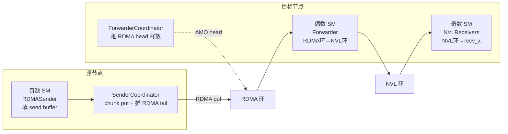
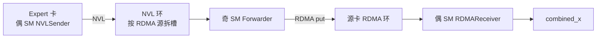

# DeepEP V1：Normal 跨机 `dispatch` / `combine` —— 双环与 WarpRole 走读

> 承接 [10](./10-deepep-v1-intranode-dispatch-kernel.md)、[11](./11-deepep-v1-intranode-combine-and-warp-roles.md)、[15](./15-deepep-v1-warp-block-queue-matrix.md)。机内路径是「单环 + 偶发奇收」；跨机要多一跳：**RDMA 环（机间）→ forwarder → NVL 环（机内）**。本文按 `WarpRole` 把 `internode.cu` 的 dispatch / combine 各走一遍。
>
> 代码：`csrc/kernels/legacy/internode.cu`；dispatch ≈ L452–L1213，host L1215–L1310；combine ≈ L1721–L2280，host L2283–L2374。`LEGACY_NUM_MAX_NVL_PEERS=8`。

```text
本次讲解位置
章节：communication / DeepEP V1
小节：normal internode dispatch / combine
知识点：偶 SM=forwarder（dispatch）/ 奇 SM=forwarder（combine）；RDMA+NVL 双环；Sender→Coordinator→Forwarder→NVLReceivers；回程 NVLSender→Forwarder→RDMAReceiver
上次：warp·block·队列矩阵（15）
下次：SourceMeta / notify_dispatch 跨机前缀，或 V2 elastic
PTX / 原语：ibgda put、amo_nonfetch_add、st.release.sys / ld.acquire.sys、TMA、bar.sync
```

## 为什么现在讲这个

矩阵课（15）已经说清「跨机是双环、combine 极性对调」，但读代码时还会卡在：

1. **偶数 SM 在跨机 dispatch 里不是「业务发送端」**，而是 RDMA→NVL 的 forwarder——和机内「偶数=发」同公式、不同语义。
2. **数据 warp 只填本地 send buffer；真正 RDMA put 多半由 Coordinator 按 chunk 发出**——分不清谁写数据、谁推 tail，会以为每个 sender warp 都在 put。
3. **combine 箭头反过来，且 NVL buffer 按 RDMA 源拆开**——不看注释会以为和 dispatch 共用同一套奇偶角色。

不把一跳 token 的「谁写 / 谁转 / 谁落」钉死，就没法对照 `send_rdma_head` / `send_nvl_head` / `combined_*_head`。

---

## 0. 心智模型：一跳 token 走多远

拓扑：全局 rank = `rdma_rank * 8 + nvl_rank`（每节点最多 8 张 NVLink GPU）。



```text
源 token
  -> 奇数 SM: RDMASender 按 channel 条带装箱到 rdma_channel_data.send
  -> 同 SM Coordinator: ibgda put 到对端 rdma_channel_data.recv，AMO 推 tail
  -> 对端偶数 SM Forwarder: 读 RDMA 环，按 SourceMeta 过滤 NVL peer，写入 NVL 环
  -> 对端奇数 SM NVLReceivers: 读 NVL 环，落到 rank-major recv_x
```

Combine 箭头反过来：

```text
expert 输出（仍按 dispatch 布局）
  -> 偶数 SM: NVLSender 写入目标 peer 的 NVL 环（按 RDMA 源拆槽）
  -> 奇数 SM: Forwarder 从 NVL 环取出、在节点内 reduce 后 put 回源 RDMA 环
  -> 源节点偶数 SM: RDMAReceiver 按 combined_rdma_head 等齐，combine_token 写入 combined_x
```

---

## 1. Dispatch：Block / Warp 怎么分（L493–L516）

```text
num_channels = num_sms / 2
channel_id   = sm_id / 2
is_forwarder = (sm_id % 2 == 0)     // 偶数 = forwarder
warps/block  = 7 + 1 + 8 = 16       // kNumDispatchRDMASenderWarps=7
```

| Block | Warp | 角色 | 一句话 |
|---|---|---|---|
| 偶数 | 0..7 | `kRDMAAndNVLForwarder` | RDMA 消费者 + NVL 生产者；`target=(warp+ch)%8` |
| 偶数 | 8+ | `kForwarderCoordinator` | 取各 forwarder 的 min head，AMO 推远端 RDMA head |
| 奇数 | 0..6 | `kRDMASender` | 本 channel token 条带装箱 |
| 奇数 | 7 | `kRDMASenderCoordinator` | chunk put + 推 RDMA tail |
| 奇数 | 8..15 | `kNVLReceivers` | NVL 环 → `recv_x`；`target` 轮转 |

```text
sm:  0        1        2        3
     FWD      SEND+    FWD      SEND+
     RDMA->NVL RECV    RDMA->NVL RECV
     +- ch0 --------+  +- ch1 --------+
```

### 1.1 双环布局（L526–L560）

```text
RDMA（SymBuffer，每 channel x 每 rdma_rank）：
  rdma_channel_data[槽]   // 定长环
  rdma_channel_meta[...]  // prefix 编码 -v-1
  rdma_channel_head/tail

NVL（AsymBuffer，机内 peer）：
  nvl_channel_x[槽]
  nvl_channel_prefix_start/end
  nvl_channel_head/tail
```

Forwarder：`ws_rr` = 目标 NVL peer（写），`rs_wr` = 本卡（读 head）。
NVLReceivers：方向对调——读 peer 写来的环，落到本卡。

---

## 2. Dispatch 走读：按角色

### 2.1 `kRDMASender`（L587–L757）：装箱，多数时候不直接 put 数据

1. **channel token 范围**（L589–L590）：`get_channel_task_range`。
2. **先发 meta**（L594–L625）：把本 channel 对各 dst 的 gbl/rdma prefix 写成 `-v-1`，非本机 dst 用 `ibgda_put` 推 meta。
3. **扫 token 装箱**（L632–L728）：
   - lane `i` 读该 token 是否属于 rdma_rank `i`（8 个 NVL bool 打包成 `uint64`）；
   - warp 交错：`(token - start) % 7 == warp_id` 才处理；
   - 等 `tail - head < 环长`；
   - 写 `send_rdma_head[token][rdma]`（combine 用）；
   - 拷贝 `x / scales / SourceMeta / topk` 到各目标的 **本地 send buffer** 槽 `tail % N`。
4. **滑动窗口**（L730–L755）：用 smem lock + 32-bit window 通知 Coordinator「哪些序号已填好可发」。

要点：**Sender 负责正确装箱；跨机大数据 put 在 Coordinator。**

### 2.2 `kRDMASenderCoordinator`（L758–L848）：chunk put + 推 tail

1. 清 smem lock/tail/window，与 Sender `barrier.sync 0`（L768–L769）。
2. 算本 channel 应对每个 `dst_rdma` 发多少 token（L772–L777）。
3. 循环（L782–L847）：
   - 读乱起点缓解 incast：`dst = (i + channel + rdma_rank) % R`；
   - 等 smem `rdma_send_channel_tail` 前进够一个 send chunk；
   - 非本地：`ibgda_put` send→对端 recv（L823–L829）；
   - `amo_nonfetch_add` 推对端 **RDMA tail**（L840–L844）。

### 2.3 `kRDMAAndNVLForwarder`（L849–L1018）：RDMA→NVL

1. **等 meta**（L857–L898）：四个 meta 均为负 → 解码 start/end，写 NVL prefix，算 `num_tokens_to_recv_from_rdma`。
2. **主循环**（L912–L1013）：
   - 等 NVL 环有空位；
   - 轮询有数据的 `src_rdma`（acquire 读其 RDMA tail）；
   - 逐 token 读 `SourceMeta`，`is_token_in_nvl_rank(dst)` 才转发；
   - 记 `send_nvl_head`；TMA 拷到 NVL 槽；release 推 **NVL tail**。
3. 置 `forward_channel_retired`（L1017–L1018）。

### 2.4 `kForwarderCoordinator`（L1019–L1060）：推 RDMA head

取所有未 retired forwarder 对某 `src_rdma` 的 **min head**；前进超过一个 send chunk 时 AMO 推远端 `rdma_channel_head`，让源端环槽可复用。

### 2.5 `kNVLReceivers`（L1061–L1196）：落 `recv_x`

1. 等 NVL prefix start/end（编码 `-v-1`），算本 channel 段在 `recv_x` 的 `total_offset`（L1075–L1102）。
2. acquire 读 NVL tail → TMA 搬 hidden/scales → 写 `recv_src_meta` → topk **本地化**（不属于本卡 expert 写 -1）（L1174–L1184）。
3. 推 NVL head 释放槽（L1193–L1194）。

最终布局仍是 **rank-major**（与机内 normal 一致），不是 LL 的 expert-major。

---

## 3. Combine：极性对调（L1751–L1786）

```text
is_forwarder_sm = (sm_id % 2 == 1)   // 奇数 = forwarder！与 dispatch 相反
kNumCombineForwarderWarps = 24
num_warps = kNumForwarders + 1
```

| Block | 角色 | 干什么 |
|---|---|---|
| **偶数** | `kNVLSender`（前 8 warp，轮转 dst nvl） | expert 输出 → 目标 peer NVL 环 |
| 偶数 | `kRDMAReceiver` | RDMA 环 → `combine_token` → `combined_x` |
| 偶数 | `kCoordinator` | 推 RDMA head 等 |
| **奇数** | `kNVLAndRDMAForwarder` | NVL 环 →（节点内按 head 归约）→ RDMA 环 put 回家 |
| 奇数 | `kCoordinator` | 推 NVL head 等 |



### 3.1 `kNVLSender`（L1789–L1927）

- 注释写明：**按不同 RDMA 源拆开 NVL buffer**，防死锁（L1794）。
- 任务范围来自 `gbl_channel_prefix_matrix`（L1822–L1826）。
- 等空位 → TMA 装 `x + SourceMeta + topk_weights` → 写 NVL 槽 → release 推 **按 rdma lane 分开的 tail**（L1925–L1926）。

### 3.2 `kNVLAndRDMAForwarder`（L1960–L2149）

- 「大 warp」：`dst_rdma = warp_id / kNumWarpsPerForwarder`，组内 sub_warp 交错（L1963–L1964）。
- 用 `combined_nvl_head` 等各 NVL 源的 expected head（L2048–L2057）。
- 多源数据在 forwarder 侧合并进 RDMA send buffer，再 put，AMO 推 RDMA tail（约 L2140）。

### 3.3 `kRDMAReceiver`（L2150–L2227）

- 与 dispatch 相同的 **token channel 条带**（L2159–L2160）。
- `combined_rdma_head[token][rdma]`：负值表示空洞（编码与机内 `send_head` 同族）。
- 等 RDMA tail 过 expected → `combine_token<...>` 求和（+bias）写入 `combined_x`（L2207–L2221）。

### 3.4 Coordinator（L2228+）

两侧各有一套：推进 RDMA head / NVL head，配合 retired 标志退出。

---

## 4. 与机内 / LL 对照

| | 机内 normal | 跨机 normal | LL |
|---|---|---|---|
| 中转 | 单 NVL 环 | RDMA 环 + NVL 环 | staging 数组 |
| SM 奇偶 | 偶发奇收 | dispatch 偶=FWD；combine 奇=FWD | 无此分工 |
| 最终 dispatch 布局 | rank-major | rank-major | expert-major |
| 回程索引 | `send_head` | `send_rdma_head` + `send_nvl_head` / `combined_*` | `layout_range` + `src_info` |
| 权重 | 默认求和 | `combine_token` 可带 topk_weights | kernel 内加权 |

---

## 5. 完整可运行核对（角色极性）

```python
#!/usr/bin/env python3
"""Check internode dispatch/combine SM polarity and warp roles."""

from __future__ import annotations


def dispatch_role(sm_id: int, warp_id: int) -> str:
    is_fwd = sm_id % 2 == 0
    if is_fwd:
        return "forwarder" if warp_id < 8 else "fwd_coord"
    if warp_id < 7:
        return "rdma_sender"
    if warp_id == 7:
        return "sender_coord"
    return "nvl_receiver"


def combine_role(sm_id: int, warp_id: int, num_forwarders: int = 24) -> str:
    is_fwd = sm_id % 2 == 1  # flipped
    if not is_fwd:
        if warp_id < 8:
            return "nvl_sender"
        if warp_id < num_forwarders:
            return "rdma_receiver"
        return "coord"
    if warp_id < num_forwarders:
        return "nvl_rdma_forwarder"
    return "coord"


def main() -> None:
    assert dispatch_role(0, 0) == "forwarder"
    assert dispatch_role(1, 0) == "rdma_sender"
    assert dispatch_role(1, 7) == "sender_coord"
    assert dispatch_role(1, 8) == "nvl_receiver"
    assert combine_role(0, 0) == "nvl_sender"
    assert combine_role(1, 0) == "nvl_rdma_forwarder"
    assert combine_role(0, 10) == "rdma_receiver"
    # polarity flip
    assert (dispatch_role(0, 0) == "forwarder") != (combine_role(0, 0) == "nvl_rdma_forwarder")
    print("dispatch sm1 warp7:", dispatch_role(1, 7))
    print("combine sm1 warp0:", combine_role(1, 0))
    print("PASS")


if __name__ == "__main__":
    main()
```

期望输出含 `PASS`。

## 6. 常见错误与症状

| 误读 | 正确 | 症状 |
|---|---|---|
| 跨机偶数 SM = 业务发送 | dispatch 偶数 = forwarder | 在偶 SM 找装箱循环找不到 |
| 每个 RDMASender 都 put 大数据 | Coordinator chunk put | 漏看 window/lock |
| combine 与 dispatch 同奇偶 | combine `is_forwarder_sm = sm%2==1` | 角色全反 |
| NVL 环全局共用 | combine 按 RDMA 源拆槽 | 死锁/错槽 |
| 跨机已是 expert-major | 仍是 rank-major + `recv_topk_idx` | 和 LL 布局混用 |

## 7. 速记卡

```text
Dispatch: 奇 SM 装箱+put → RDMA环 → 偶 SM 转发 → NVL环 → 奇 SM 落 recv_x
Combine:  偶 SM NVL发 → NVL环 → 奇 SM 转发归约 → RDMA环 → 偶 SM reduce → combined_x
Sender 装箱 / Coordinator 发；Forwarder 转；Receiver 落
偶/奇在 combine 对调；双环 head/tail；meta/head 编码 -v-1
```

## 8. 自测题与答案

1. **Dispatch 里真正跨机 put 数据主体的角色？**
   答：`kRDMASenderCoordinator`（L815–L844）；Sender 主要装箱并推进 smem window。

2. **Forwarder 如何决定要不要把 RDMA 槽转给某 NVL peer？**
   答：读 `SourceMeta.is_token_in_nvl_rank(dst_nvl_rank)`（L969–L979）。

3. **Combine 的 forwarder 在奇偶哪侧？**
   答：奇数 SM（`is_forwarder_sm = sm_id % 2 == 1`，L1752）。

4. **NVLReceivers 写 `recv_topk_idx` 时做了什么变换？**
   答：全局 expert ∈ 本卡范围 → 减成本地 id，否则 -1（L1181–L1182）。

5. **RDMAReceiver 用什么判断某 rdma 源是否参与该 token？**
   答：`combined_rdma_head[token][rdma]`；负值表示空洞（L2168–L2171）。

## 9. 学习进度

- [x] 机内 dispatch / combine（10/11）
- [x] LL 路径与矩阵（12–15）
- [x] Normal 跨机 dispatch / combine WarpRole 走读
- [ ] SourceMeta 与跨机 notify 前缀精读（可选）

### 下一知识点

`SourceMeta` 打包与 `notify_dispatch` 跨机 prefix（`rdma_channel_prefix_matrix` / `gbl_channel_prefix_matrix`）如何喂给本课的 meta 发送。
