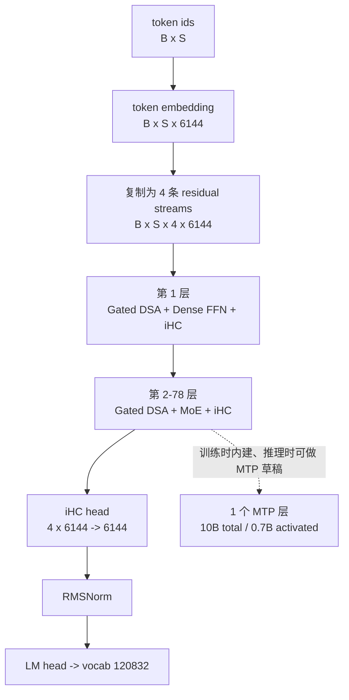
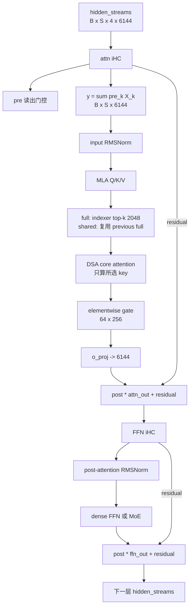

# Tencent Hy4 Preview 架构笔记

> 主要依据：
> - [Tencent-Hunyuan/Hy4-preview README](https://github.com/Tencent-Hunyuan/Hy4-preview)
> - [Hugging Face `tencent/Hy4-preview`](https://huggingface.co/tencent/Hy4-preview)
> - [Hugging Face checkpoint `config.json`](https://huggingface.co/tencent/Hy4-preview/raw/main/config.json)
> - [Transformers `modeling_hy_v4.py`](https://github.com/huggingface/transformers/blob/main/src/transformers/models/hy_v4/modeling_hy_v4.py)
> - [Transformers `configuration_hy_v4.py`](https://github.com/huggingface/transformers/blob/main/src/transformers/models/hy_v4/configuration_hy_v4.py)
> - [DeepSeek Sparse Attention 论文](https://arxiv.org/abs/2512.02556)
> - [IndexCache 论文](https://arxiv.org/abs/2603.12201)

## 本次讲解位置

```text
本次讲解位置
章节：models / Hy4 preview
小节：整体结构、Gated DSA、IndexCache、iHC
知识点：Full/Shared 索引复用、门控注意力、恒等超连接
上次：MiMo-V2.6-Flash 的 SWA / GA / GQA
下次：待定
PTX：不适用
```

## 为什么现在讲这个

上一节 MiMo 解决的是“每个 query 能看到哪些位置”和“多个 Q 头如何共享 KV”：GA/SWA 决定可见范围，GQA 决定头之间的共享关系。Hy4 把这个视角再推进两步：

1. 即使上下文是 1M，也不必让每层都为每个 query 完整扫描 1M 个 key。DSA 先用轻量 indexer 选出少量 token，再让主注意力只计算这些 token。
2. 如果相邻层选出来的 token 高度相似，就没有必要每层都重跑 indexer。IndexCache 只复用“选中了哪些 token”，主注意力参数仍然逐层独立；这正是容易误解的地方。

Hy4 还用 iHC 把单条 residual 扩成 4 条流。若把 iHC 简化成普通 residual，就会漏掉 \(H_{\text{pre}}\)、\(H_{\text{post}}\)、\(H_{\text{res}}\) 这三个控制量；若又把它当成 mHC，则会错误地认为残差流之间每层都会做 Sinkhorn 混合。

## 1. 一眼看懂

Hy4 preview 是稀疏 MoE 文本模型。主干 78 层，第 1 层使用 dense FFN，后 77 层使用 MoE；每层 attention 都是 Gated DSA。模型另有 1 个原生 MTP 层用于投机解码。



“Full/Shared” 指 indexer 的跨层复用方式，不指主 attention 的 Q/K/V 参数复用。78 层中有 21 个 full indexer、57 个 shared indexer：

```text
0-based 层号：
full   full   shared shared shared
full   shared shared shared
...
full   shared shared shared
full

full 层：
[0, 1, 5, 9, 13, 17, 21, 25, 29, 33, 37,
 41, 45, 49, 53, 57, 61, 65, 69, 73, 77]
```

## 2. 官方规格与关键维度

下面数字来自官方模型卡和 checkpoint config。MTP 的 10B/0.7B 不计入主干 770B/49B。

| 项目 | 数值 | 含义 |
|---|---:|---|
| 总参数 / 激活参数 | 770B / 49B | 稀疏 MoE 主干 |
| 层数 | 78 | 第 1 层 dense，其余 77 层 MoE |
| hidden size | 6144 | \(H\) |
| residual streams | 4 | \(N=4\) 条 iHC 流 |
| attention heads | 64 | \(A=64\) |
| query compression rank | 2048 | q LoRA latent |
| KV compression rank | 512 | MLA latent |
| Q/K head dim | 256 | 192 nope + 64 RoPE |
| V head dim | 256 | 主 attention value |
| indexer heads / head dim | 32 / 128 | DSA 的轻量打分头 |
| indexer top-k | 2048 | 每个 query 最多选 2048 个 key |
| routed experts | 256 | 每 token 选 top-8 |
| shared experts | 1 | 每 token 固定执行 |
| MoE intermediate | 2048 | 单个 expert 的 FFN 中间维 |
| dense FFN intermediate | 18432 | 第 1 层 FFN 中间维 |
| 上下文 / vocab | 1M / 120832 | 最大位置数与词表 |
| MTP | 1 层，10B / 0.7B active | 投机器，不进入主干层数 |

一个容易踩坑的字段是 checkpoint JSON 中的 `num_key_value_heads=8`。Hy4 使用 MLA：KV 先压成 512 维 latent，再展开到每个 query head；Transformers 的 `HYV4Config.__post_init__()` 明确执行：

```python
self.num_key_value_heads = self.num_attention_heads
```

因此不应把这个 JSON 字段解释成“Hy4 采用 8 个 KV head 的普通 GQA”。Hy4 的核心 attention 是 MLA/DSA，不是 MiMo 那种 GQA 分组。

## 3. 术语先分清：GA、GQA、DSA、Gated、IndexCache、iHC

| 术语 | 它决定什么 | Hy4 是否使用 |
|---|---|---|
| GA | 可见范围是否覆盖全部历史 | 否 |
| SWA | 可见范围是否限制在局部窗口 | 否 |
| GQA | 多少个 Q 头共享同一组 K/V | 否；JSON 的 8 不是普通 GQA 配置 |
| MLA | Q/K/V 是否经过低秩 latent 压缩 | 是 |
| DSA | 每个 query 动态选哪些 key | 是，top-k 2048 |
| Gated DSA | 主 attention 输出是否再做逐元素门控 | 是，\(64\times256\) gate |
| IndexCache | full/shared 层是否复用 sparse indices | 是，21 full + 57 shared |
| iHC | residual 是单流还是多流，如何读写 | 是，4 条流且 \(H_{\text{res}}=I_4\) |

DSA 和 GQA 不在同一维度：DSA 改的是“算哪些 token”，GQA 改的是“多少 Q 头共用 KV”。把 attention 输出乘一个 gate，也不同于 GQA。

## 4. Gated DSA 的完整数据路径

设 batch size 为 \(B\)，序列长度为 \(S\)。下面的形状省略算子内部可能出现的 transpose，只保留可对照源码的维度。

### 4.1 从 4 条 iHC 流得到单路子模块输入

```text
hidden_streams                  [B, S, 4, 6144]
flatten                         [B, S, 24576]
attn_hc.pre                     [B, S, 4]
attn_hc 输出 y                  [B, S, 6144]
```

随后做 `input_layernorm`，进入 attention。Attention 和 FFN 各自有独立的 iHC controller。

### 4.2 MLA 生成 Q/K/V

```text
x
├── q_a_proj:       6144 -> 2048
├── q_a_layernorm:  2048
└── q_b_proj:       2048 -> 64 * 256
    Q: [B, 64, S, 256]

x
├── kv_a_proj_with_mqa: 6144 -> 512 + 64
├── kv latent cache:    [B, 1, S, 512]
└── RoPE key:           [B, 1, S, 64]

kv latent + RoPE key
└── kv_b_proj
    K: [B, 64, S, 256]
    V: [B, 64, S, 256]
```

KV cache 在压缩 latent 状态保存，而不是为 64 个头分别保存完整 K/V。这也是 MLA 省 KV cache 的关键。

### 4.3 Indexer 先做轻量打分

每个 full indexer 有自己的一套参数：

```text
index query:
  q_resid [B, S, 2048] --wq_b--> [B, S, 32, 128]

index key:
  hidden  [B, S, 6144] --wk----> [B, S, 128] --k_norm-->
  cache                                      [B, K, 128]

head weights:
  hidden  [B, S, 6144] --weights_proj--> [B, S, 32]
```

对 query 位置 \(t\) 和 key 位置 \(s\)，indexer 分数为：

\[
I_{t,s}
=
\sum_{j=1}^{32}
w^{I}_{t,j}
\operatorname{ReLU}
\left(
q^{I}_{t,j}\cdot k^{I}_{s}
\right)
\operatorname{mask}_{t,s}
\]

因果 mask 会把未来位置压成 \(-\infty\)。随后：

\[
\mathcal T_t
=
\operatorname{TopK}_{s}(I_{t,s},\ 2048)
\]

源码中的 head weight 在求和前已缩放：

\[
w^{I}_{t,j}
=
\operatorname{weights\_proj}(x_t)_j
\cdot
32^{-1/2}
\cdot
128^{-1/2}
\]

这里的 32 是 indexer head 数，128 是 index head dim。实现使用 bf16/fp32 直接算 score；参考实现中的 Hadamard transform 保持点积，FP8 则属于精度/吞吐优化，因此 Transformers 代码可以跳过二者。

### 4.4 主 attention 只处理被选中的 token

令 \(\mathcal T_t\) 是 query \(t\) 选出的 key 集合：

\[
z_t^{(h)}
=
\sum_{s\in\mathcal T_t,\ s\le t}
\operatorname{softmax}_{s}
\left(
\frac{q_t^{(h)}\cdot k_s^{(h)}}{\sqrt{d}}
\right)
v_s^{(h)}
\]

核心 attention 的分数计算从：

\[
O(S^2)
\]

降为：

\[
O(S\cdot 2048).
\]

但这不表示整个 DSA 是线性的：indexer 仍要对历史 key 打分，朴素形式仍接近 \(O(S^2)\)，只是它的 head dim 和投影明显更小。IndexCache 优化的正是这部分 indexer 计算。

### 4.5 Elementwise gate

Hy4 与普通 DSA 的另一个可见差异是 attention output gate：

```text
gate_states = gate_proj(hidden_states)
            = [B, S, 64, 256]

attn_output = attn_output * sigmoid(gate_states)
```

也就是每个 head、每个 value 维度都有自己的门：

\[
u_{t,h,d}
=
z_{t,h,d}\cdot
\sigma\left(G_{t,h,d}\right)
\]

其中：

\[
G=\operatorname{reshape}
\left(
W_{\text{gate}}x,
[B,S,64,256]
\right).
\]

最后：

```text
flatten([B, S, 64, 256]) -> [B, S, 16384]
o_proj: 16384 -> 6144
```

源码中另有 per-head learnable sink：

```python
self.sinks = nn.Parameter(
    torch.full((self.num_heads,), config.learnable_sink_init)
)
```

checkpoint 中 `learnable_sink=true`，`learnable_sink_init=0.0`。它在 softmax 的归一化项中增加一个可学习的 logit；sink 本身没有 value 输出。它与 4.5 的 elementwise gate 不是一回事。

### 4.6 层内完整执行路径



## 5. IndexCache 到底是什么

### 5.1 先给结论

把用户通常会有的理解写成一句话：

> Shared 层使用之前 full 层选出的 top-k 索引，不再运行自己的 indexer，也没有自己独立的一套 indexer 参数。

这句话基本正确，但还要补两点：

1. 复用发生在**同一次 forward** 内，不是跨请求保存一个磁盘 cache。模型 forward 开头把 `topk_indices=None`，逐层传递到下一层。
2. Full 层和 shared 层的**主 attention 参数、gate、MoE/FFN 参数仍然各自独立**。复用的只有索引 \(\mathcal T\)，不是 hidden states、Q/K/V、KV latent 或 attention output。

源码行为非常直接：

```python
self.skip_topk = config.indexer_types[layer_idx] == "shared"
self.indexer = None if self.skip_topk else HYV4Indexer(config, layer_idx)

if self.indexer is not None:
    topk_indices = self.indexer(
        hidden_states,
        q_resid,
        position_embeddings,
        attention_mask[:, 0, :, :],
        position_ids,
        past_key_values=past_key_values,
    )
else:
    if prev_topk_indices is None:
        raise ValueError(
            "Shared DSA layers require top-k indices from a previous full indexer layer."
        )
    topk_indices = prev_topk_indices
```

因此“shared 层自己重新学习一个 indexer，只是初始化用前一层的索引”并不准确。shared 层根本没有 indexer 模块。

### 5.2 Full 与 Shared 的数学形式

对 full 层 \(\ell\)：

\[
\mathcal T^{(\ell)}
=
\operatorname{TopK}
\left(
I^{(\ell)}
\right),
\qquad
\mathcal T_{\text{cache}}
\leftarrow
\mathcal T^{(\ell)}
\]

对 shared 层：

\[
\mathcal T^{(\ell)}
=
\mathcal T_{\text{cache}}
\]

令 query token 为 \(t\)，则 \(\mathcal T^{(\ell)}_t\) 的物理形状是 \(K_{\text{top}}\) 个 token id；运行张量为 `int32 [B,S,2048]`。在 Hy4 的层表中，第 1、2 层是连续两个 full 层，之后每个 full 层后面跟 3 个 shared 层。

### 5.3 为什么 shared 层还能有不同行为

即使 4 层使用同一组 key 索引，每层仍有：

```text
独立的 Q projection
独立的压缩 KV projection / KV latent
独立的 attention output projection
独立的 elementwise gate
独立的 MoE router 与 experts
独立的 iHC controller
```

所以共享的是“搜索结果的地址列表”，不是“搜索过程”和“搜索结果内容”。同一组 token id 在各层会进入不同的 Q/K/V 空间，得到不同 attention output。

### 5.4 IndexCache 论文中的训练机制

官方 README 说明 Hy4 使用 IndexCache，但公开模型卡没有展开训练细节。IndexCache 论文给出的通用机制是：保留部分 full indexer，让一个 full indexer 服务随后的多层；再让 indexer 学习多层共同认可的 top-k，而不是只迎合某一层。

若 full 层为 \(\ell\)，后面复用它的层是 \(\ell+1,\ldots,\ell+m\)，论文用多层蒸馏描述为：

\[
\mathcal L^{I}_{\text{multi}}
=
\sum_{j=0}^{m}
\frac{1}{m+1}
\sum_t
D_{\mathrm{KL}}
\left(
p^{(\ell+j)}_t
\middle\Vert
q^{(\ell)}_t
\right)
\]

其中 \(q^{(\ell)}\) 是 full indexer 的分布，\(p^{(\ell+j)}\) 是后续层希望选中的分布。对每个 query，这一目标与“先求后续多层平均目标 \(\bar p_t\)，再对 \(\bar p_t\) 做蒸馏”的梯度等价。

这段属于 IndexCache 论文的通用机制说明，不应直接当成 Hy4 checkpoint 的逐行训练配方。Hy4 公开可验证的是配置中的 `full/shared` 类型和推理源码里的复用路径。

### 5.5 收益与代价

IndexCache 论文在 30B DSA 实验上报告：

| 指标 | 论文报告结果 |
|---|---:|
| indexer 计算量下降 | 75% |
| prefill 最高加速 | 1.82x |
| decode 最高加速 | 1.48x |

这些是论文实验，不是 Hy4 preview 的 benchmark。共享索引也可能损失“某一层本来需要单独选择别的 token”的能力；论文的训练感知蒸馏就是为了降低这个损失。

### 5.6 一个 1M context 的具体路径

假设：

```text
B = 1
S = 1,000,000
topk = 2048
```

在 full 层：

1. Indexer 对每个 query 的历史 key 打分。
2. 对 query \(t=1{,}000{,}000\) 选出 2048 个 token id。
3. 该层的 64 个主 attention heads 只对 2048 个 selected keys 做核心 attention。

在接着的 3 个 shared 层：

1. 直接读取 shape `[1, 1,000,000, 2048]` 的索引。
2. 不再运行那套 `32 x 128` 的 indexer。
3. 3 层各自用自己的 Q/K/V 和 gate 处理这 2048 个位置。

如果 \(S=512\)，则 `topk = min(2048, S) = 512`，DSA 没有筛掉任何 key；DSA 的稀疏收益要从长上下文开始体现。

## 6. MoE、MTP 与主干数据流

### 6.1 MoE

后 77 层每层：

\[
\mathcal E(x)
=
\operatorname{TopK}
\left(
\operatorname{Router}(x),
8
\right)
\]

\[
\operatorname{MoE}(x)
=
\sum_{e\in\mathcal E(x)}
w_e(x)\operatorname{Expert}_e(x)
+
\operatorname{SharedExpert}(x)
\]

checkpoint 中 `n_group=1`、`topk_group=1`，按配置注释等价于在所有 256 个 routed experts 上直接做 global top-8。`norm_topk_prob=true`，路由权重再做归一化，`routed_scaling_factor=2.827`。shared expert 每个 token 都执行，不参与 router 的 top-k 竞争。

### 6.2 原生 MTP

Hy4 额外带 1 个 MTP 层，10B total / 0.7B activated，用于投机解码。官方部署示例把它作为 MTP/NEXTN drafter，与 78 层主干分开。它不改变下列主干计数：

```text
770B total
49B activated per token
78 backbone layers
first layer dense FFN
remaining 77 layers MoE
```

## 7. iHC：identity Hyper-Connections

### 7.1 问题：普通 residual 只有一条流

标准 Transformer 每层可写成：

```text
x <- x + Sublayer(Norm(x))
```

信息只有一条 residual highway。Hyper-Connections 把 hidden state 扩成 \(N\) 条并行流：

\[
X\in\mathbb R^{N\times H}
\]

Hy4 中：

\[
N=4,\qquad H=6144.
\]

每层 attention 和 FFN 之前，各自用一组动态系数从多流中读出单路输入；子模块算完，再把单路输出写回多流。Hy4 的关键区别是：**写回时不做跨流线性混合**，所以叫 identity Hyper-Connections（iHC）。

### 7.2 \(H_{\text{pre}}\)、\(H_{\text{post}}\)、\(H_{\text{res}}\) 的维度

先忽略 \(B,S\)，只看一个 token 的数学形状：

| 矩阵 | 概念形状 | Hy4 中的值 | 作用 |
|---|---:|---|---|
| \(H_{\text{pre}}\) | \([1,N]=[1,4]\) | 动态、由 sigmoid 得到 | 把 4 条流读成 1 路子模块输入 |
| \(H_{\text{post}}\) | \([N,1]=[4,1]\) | 动态、由 \(2\sigma\) 得到 | 把 1 路子模块输出写回 4 条流 |
| \(H_{\text{res}}\) | \([N,N]=[4,4]\) | 固定 \(I_4\) | 把旧 4 条流映射到新 4 条流 |

带上 batch 和 token 维，运行时的概念形状是：

```text
hidden_streams : [B, S, 4, 6144]
H_pre          : [B, S, 1, 4]
H_post         : [B, S, 4, 1]
H_res          : [B, S, 4, 4]
```

这里 \(H_{\text{pre}}\)、\(H_{\text{post}}\) 是对每个 token 动态计算的；不是四个全局标量。源码里先存为一维 `[B,S,4]`，做广播时分别等价于 `[B,S,1,4]` 和 `[B,S,4,1]`。

### 7.3 iHC 的数学形式

对一个 token 的列向量约定：

\[
Y
=
H_{\text{pre}}X
\]

\[
X'
=
H_{\text{post}}O
+
H_{\text{res}}X
\]

其中：

```text
X  [4, 6144]
Y  [1, 6144]
O  [1, 6144]      # Attention 或 FFN 输出
X' [4, 6144]
```

Hy4 的 iHC 设置：

\[
H_{\text{res}}=I_4
\]

所以逐流展开就是：

\[
X'_j
=
H_{\text{post},j}O
+
X_j.
\]

这解释了 “identity” 的含义：

- 不是完全无门控。\(H_{\text{pre}}\)、\(H_{\text{post}}\) 仍然动态。
- identity 指 \(H_{\text{res}}\)：旧流只回到同编号的新流，不和其他流混合。
- 子模块的输入 \(Y\) 仍可由 4 条流共同贡献，因此层与层之间并非 4 条完全隔绝的信息通道。

### 7.4 源码参数与形状

Hy4 每层有 `attn_hc` 和 `ffn_hc` 两个 `HYV4HyperConnection`。每个 controller 包含：

| 参数 | 形状 | 作用 |
|---|---:|---|
| `fn` | `[8, 24576]` | 从 flatten 的 4 条流生成 pre/post logits |
| `base` | `[8]` | pre/post 各 4 个 bias |
| `scale` | `[2]` | 分别缩放 pre 和 post logits |

其中：

\[
2N=8,\qquad N\cdot H=4\cdot6144=24576.
\]

源码数据流：

```python
flat = hidden_streams.flatten(2).float()          # [B, S, 4 * 6144]
mixes = F.linear(flat, self.fn.float()) * self.input_norm(flat)
# mixes: [B, S, 8]

pre_b, post_b = self.base.split(4)
pre_scale, post_scale = self.scale.unbind(0)
pre_logits, post_logits = mixes.split(4)

pre = sigmoid(pre_logits * pre_scale + pre_b) + 1e-6
post = 2.0 * sigmoid(post_logits * post_scale + post_b) + 1e-6

out = sum(pre.unsqueeze(-1) * hidden_streams, dim=2)
```

再对应到 Decoder：

```python
residual = hidden_streams
post, y = attn_hc(hidden_streams)
o = attention(input_layernorm(y))
hidden_streams = post[..., None] * o[..., None, :] + residual

residual = hidden_streams
post, y = ffn_hc(hidden_streams)
o = mlp(post_attention_layernorm(y))
hidden_streams = post[..., None] * o[..., None, :] + residual
```

这里 `post` 是 `[B,S,4]`，`post[..., None]` 变成 `[B,S,4,1]`；广播后给 4 条流分配同一个子模块输出的不同幅度。由于残差项直接加回 `residual`，实现的是 \(H_{\text{res}}=I_4\)。

iHC controller 全程在 fp32 中计算 mixing 和输出，再转回 hidden states 的 dtype。`hc_magnitude=2.0`，所以 post gate 范围为约 \((0,2)\)，单条流可放大子模块输出。

### 7.5 具体数字例子

设某一 token 的 4 条残差流、只看第 1 个 hidden 坐标：

```text
X[:, 0] = [1, 0, 0, 0]
```

假设动态算出：

```text
pre  = [0.1, 0.2, 0.3, 0.4]
post = [0.5, 1.0, 1.5, 2.0]
```

则子模块输入在该坐标上是：

\[
Y_0
=
0.1\cdot1
+
0.2\cdot0
+
0.3\cdot0
+
0.4\cdot0
=0.1.
\]

若 Attention/FFN 输出 \(O_0=10\)，iHC 写回：

\[
X'_0=0.5\cdot10+1=6
\]

\[
X'_1=1.0\cdot10+0=10
\]

\[
X'_2=1.5\cdot10+0=15
\]

\[
X'_3=2.0\cdot10+0=20.
\]

4 条流都接收到同一个子模块输出，但幅度不同；旧残差没有跨流搬运，因为 \(H_{\text{res}}=I_4\)。

### 7.6 iHC 与 mHC 的区别

mHC 的 `comb` 会把旧 residual 做跨流混合，并用 Sinkhorn 约束该混合矩阵。Hy4 的源码注释直接写明：

> The overall difference lies in the dropping of the `comb` output which skips the sinkhorn part of the algorithm.

| 项目 | Hy4 iHC | mHC |
|---|---|---|
| residual 流数 | 4 | 通常也是 4 |
| \(H_{\text{pre}}\) | 动态 | 动态 |
| \(H_{\text{post}}\) | 动态 | 动态 |
| \(H_{\text{res}}\) | 固定 \(I_4\) | 动态 `comb` |
| 跨流 residual 混合 | 无 | 有 |
| Sinkhorn | 无 | 有 |
| 额外计算与数值约束 | 更轻 | 更重 |

一句话：**iHC 保留了 HC 的“多流读写”，删掉了 mHC 的“旧流重组”。**不能再把二者当成同一个 residual 模块。

### 7.7 最终收束

78 层之后仍是 `[B,S,4,6144]`。`HYV4HyperHead` 用类似的动态 pre gate 把 4 条流收成 `[B,S,6144]`，随后经过主干 RMSNorm 和 LM head，得到词表 logits。

## 8. 常见误区与症状

| 误区 | 正确理解 | 会出现什么误判 |
|---|---|---|
| `num_key_value_heads=8` 表示 Hy4 使用普通 GQA | `__post_init__` 会把 KV heads 改成 64；主路径是 MLA | 会按 GQA 的 KV cache 和 head repeat 逻辑估错 |
| DSA 把 attention 变成了严格 \(O(L)\) | 主 attention 是 \(O(Lk)\)，indexer 仍要扫描历史 | 会低估 prefill 的 indexer 开销 |
| IndexCache 复用上一层 hidden states | 只复用 top-k token indices | 会错误认为 shared 层共享 Q/K/V 或输出 |
| Shared 层训练了自己的 indexer | Shared 层 `indexer=None`，没有独立 indexer | 会错误统计 indexer 参数量 |
| IndexCache 跨请求持久保存 | 当前实现是单次 forward 内逐层传递 | 会把它误当成 KV cache 或 disk cache |
| top-k=2048 是上下文长度 | 上下文是 1M；2048 是每 query 的 key 预算 | 会把上下文窗口估小 512 倍 |
| iHC 就是普通 residual | 它有 4 条流和动态 pre/post gate | 会忽略多流 residual 的显存与参数 |
| iHC 与 mHC 只是命名不同 | iHC 删除 `comb`，跳过 Sinkhorn | 会错误计算跨流混合和约束成本 |
| Elementwise gate 与 attention sink 是同一机制 | Gate 缩放 value 结果；sink 是 softmax 的额外 logit | 会混淆训练参数和推理行为 |
| MTP 包含在 78 层中 | MTP 是 1 个独立层，不计入主干 78 层 | 会把 770B/49B 与 MTP 参数重复计数 |

## 9. 自测

### Q1：Hy4 有多少 full indexer、多少 shared indexer？

21 个 full，57 个 shared。0-based full 层是
`[0, 1, 5, 9, ..., 73, 77]`。

### Q2：Shared 层到底共享了什么，哪些东西仍独立？

共享的是 previous full layer 在当前 forward 中产生的 top-k token indices。Q projection、KV projection、KV latent、attention output projection、gate、MoE/FFN 和 iHC 参数都仍然逐层独立。Shared 层没有自己的 indexer。

### Q3：\(H_{\text{pre}}\)、\(H_{\text{post}}\)、\(H_{\text{res}}\) 分别是什么维度？

单个 token 的概念维度分别是 \([1,4]\)、\([4,1]\)、\([4,4]\)。加入 batch、sequence 后是 `[B,S,1,4]`、`[B,S,4,1]`、`[B,S,4,4]`。Hy4 中 \(H_{\text{res}}=I_4\)。

### Q4：iHC 与 mHC 最重要的实现差异是什么？

iHC 删除 `comb`，所以 \(H_{\text{res}}\) 固定为单位矩阵，不做跨流混合，也没有 Sinkhorn。mHC 会动态生成受约束的 `comb`，允许旧 residual 在流之间重组。

### Q5：DSA 为什么不等于“便宜的全上下文 attention”？

它把主 attention 的打分范围降为每个 query 的 2048 个选中 key，但 indexer 仍需要评估历史 key；朴素 indexer 的 score 矩阵仍接近 \(O(L^2)\)。IndexCache 的价值是让多个 shared 层跳过重复 indexer，而不是消除 selection 问题本身。

## 10. 结论

Hy4 preview 可以压缩成四条主线：

1. **容量**：770B 总参数、49B 激活，78 层中 1 层 dense FFN，其余 77 层使用 256 routed + 1 shared 的 MoE。
2. **稀疏 attention**：Gated DSA 用 32 个 indexer head 选 top-2048，再做 64-head MLA，并对输出执行 \(64\times256\) elementwise gate。
3. **跨层复用**：21 个 full indexer 产生索引，57 个 shared 层直接复用；主模型参数不复用。
4. **残差拓扑**：4 条 iHC 流，动态 pre/post gate，\(H_{\text{res}}=I_4\)；它不是 mHC，也不是普通单流 residual。

## 来源

- [Tencent-Hunyuan/Hy4-preview GitHub](https://github.com/Tencent-Hunyuan/Hy4-preview)
- [Hugging Face `tencent/Hy4-preview`](https://huggingface.co/tencent/Hy4-preview)
- [Hy4 preview `config.json`](https://huggingface.co/tencent/Hy4-preview/raw/main/config.json)
- [Transformers `modeling_hy_v4.py`](https://github.com/huggingface/transformers/blob/main/src/transformers/models/hy_v4/modeling_hy_v4.py)
- [Transformers `configuration_hy_v4.py`](https://github.com/huggingface/transformers/blob/main/src/transformers/models/hy_v4/configuration_hy_v4.py)
- [DeepSeek Sparse Attention, arXiv:2512.02556](https://arxiv.org/abs/2512.02556)
- [IndexCache, arXiv:2603.12201](https://arxiv.org/abs/2603.12201)
- [iHC 官方介绍](https://zhuanlan.zhihu.com/p/2010852389670908320)
