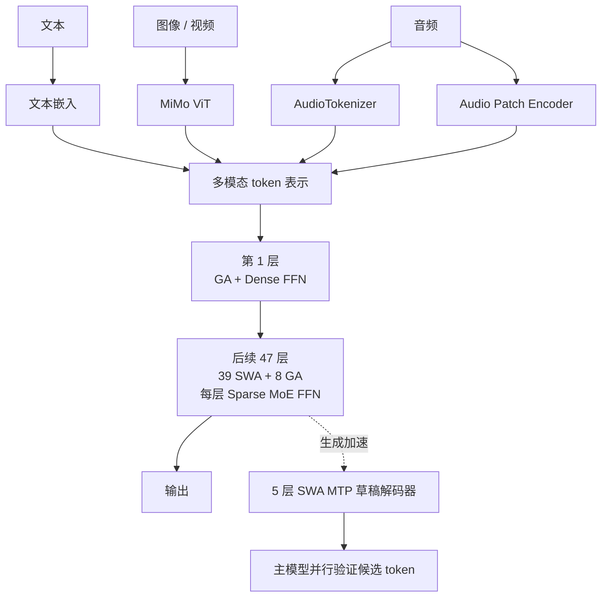

# MiMo-V2.6-Flash Architecture Notes

> 参数与结构依据小米官方 [MiMo-V2.6-Flash 模型卡](https://huggingface.co/XiaomiMiMo/MiMo-V2.6-Flash-RL) 和 [Technical Report](https://huggingface.co/XiaomiMiMo/MiMo-V2.6-Flash-RL/blob/main/MiMo_V2_6_technical_report.pdf)。MOPD checkpoint 是在 Flash-RL 上继续做后训练的版本；这里记录 MiMo-V2.6-Flash 主体架构。

## 一眼看懂

MiMo-V2.6-Flash 是原生多模态稀疏 MoE Transformer。语言主干混排滑动窗口注意力（SWA）和全局注意力（GA）；视觉与音频由专用编码器处理后进入语言主干。



图中的“多模态 token 表示”是概念级概括；具体模态对齐与融合路径以技术报告和实现为准。

## 关键配置

| 项目 | 配置 |
|---|---:|
| 总参数 / 激活参数 | 309B / 15B |
| 最大上下文 | 1M tokens |
| Transformer 主干 | 48 层，hidden size 4096 |
| 注意力层 | 39 SWA + 9 GA |
| Routed experts | 256 个；每个 token 激活 8 个 |
| 模态 | 文本、图像、视频、音频 |

第一层使用 GA 和稠密 FFN。其余 47 层交错安排 SWA 与 GA，并使用稀疏 MoE FFN；模型卡注明没有 shared experts。

## GA 与 SWA

GA 和 SWA 都是注意力计算。**GA 描述可见范围是整个历史，SWA 描述可见范围限制在局部窗口；GQA 描述 Q 头与 KV 头的分组方式。**因此 GA/SWA 与 GQA 是不同维度的概念。

### GQA 投影形状

主干的 QK 头维度为 192，V 头维度为 128：

| 注意力类型 | Q 头 | KV 头 | 窗口 |
|---|---:|---:|---:|
| GA | 64 | 4 | 全部可见历史 |
| SWA | 64 | 8 | 128 |

对输入 \(X\)，按头拆分后的张量形状为：

```text
Q: [T, 64, 192]
K: [T, H_kv, 192]    # GA: H_kv=4；SWA: H_kv=8
V: [T, H_kv, 128]
```

Q 头数多于 KV 头数，所以多个 Q 头共享一组 K/V，这就是 GQA。以下公式按常见的均匀分组记法描述，令 \(g(h)\) 表示 Q 头 \(h\) 所属的 KV 头；模型卡公开头数，但未在表格中规定分组索引的具体排列。

对 query 头 \(h\)，注意力分数及输出为：

\[
s_{i,j}^{(h)}
=
\frac{(q_i^{(h)})^\top k_j^{(g(h))}}{\sqrt{192}}
+ M_{i,j}
\]

\[
\alpha_{i,j}^{(h)}
= \operatorname{softmax}_{j}(s_{i,j}^{(h)}),
\qquad
z_i^{(h)}
= \sum_{j\in\mathcal{V}(i)}
\alpha_{i,j}^{(h)}v_j^{(g(h))}
\]

其中 \(\mathcal{V}(i)\) 是位置 \(i\) 可见的位置集合，\(M\) 是 attention mask。所有头的 \(z_i^{(h)}\) 拼接后，再通过输出投影 \(W_O\)。

### GA：全局因果注意力

自回归解码时，位置 \(i\) 可看到自身及此前所有位置：

\[
\mathcal{V}_{\mathrm{GA}}(i)=\{j\mid 1\le j\le i\}
\]

\[
M^{\mathrm{GA}}_{i,j}
=
\begin{cases}
0, & j\le i\\
-\infty, & j>i
\end{cases}
\]

未来位置被 mask；“全局”不是双向看未来，而是能访问整个可见历史。

### SWA：局部因果滑窗注意力

模型卡给出的 sliding window size 为 \(w=128\)。按“窗口总长包含当前位置”的约定：

\[
\mathcal{V}_{\mathrm{SWA}}(i)
=
\{j\mid \max(1,i-w+1)\le j\le i\}
\]

\[
M^{\mathrm{SWA}}_{i,j}
=
\begin{cases}
0, & \max(1,i-w+1)\le j\le i\\
-\infty, & \text{其他情况}
\end{cases}
\]

例如 \(i=1000\) 时，若 \(w=128\)，可见位置是 873 到 1000，共 128 个 token。模型卡没有进一步说明窗口边界的实现细节，因此该端点约定用于公式说明。

| 机制 | 位置 \(i\) 可关注的位置 | 主要效果 |
|---|---|---|
| GA | \(1\ldots i\) | 可直接建立长距离依赖；注意力范围随上下文增长 |
| SWA | \(\max(1,i-127)\ldots i\) | 范围固定为 128；局部计算更省 |
| GQA | 不决定可见范围 | 多个 Q 头共享 KV 头，减少 KV cache 与带宽需求 |

## MoE FFN

MoE FFN 可抽象为 router 选取 top-\(k\) 专家，再组合其输出：

\[
\mathcal{E}(x)=\operatorname{TopK}(\operatorname{Router}(x), k=8)
\]

\[
\operatorname{MoE}(x)
=
\sum_{e\in\mathcal{E}(x)}
w_e(x)\operatorname{Expert}_e(x)
\]

MiMo-V2.6-Flash 有 256 个 routed experts，每个 token 激活其中 8 个。稀疏激活使总参数规模（309B）显著高于单 token 的激活参数量（15B）；这不表示运行时只需存储 15B 参数。

## 多模态编码器

| 编码器 | 结构摘要 |
|---|---|
| MiMo ViT | 681M 参数；28 层，其中 24 SWA、4 GA；hidden size 1280；时空 patch 为 \(2\times16\times16\) |
| AudioTokenizer | 308M 参数；24 层，其中 12 SWA、12 GA；hidden size 1024；20 个 RVQ codebooks |
| Audio Patch Encoder | 127M 参数；6 层；每个 patch 合并 4 帧，时间采样从 25 Hz 降到 6.25 Hz |

## MTP 草稿解码器

模型卡描述了一个 5 层 SWA MTP drafter，窗口为 1024，采用 DFlash-style speculative decoder；每次 forward 可预测后续 7 个 token，再由主模型并行验证。它是生成加速组件，不是主干 48 层计数的一部分。

## 易混点

- **GA 不等于 GQA**：GA 是全局注意力范围；GQA 是 Q/KV 头共享关系。MiMo 的 GA 和 SWA 都采用 GQA，只是 KV 头数不同。
- **Flash 不等于小参数量**：这是约 309B 总参数、15B 激活参数的稀疏 MoE。
- **窗口大小不是上下文上限**：SWA 窗口是 128；模型整体上下文上限为 1M，长距离信息由 GA 层提供全局路径。
- **MTP 不属于额外 48 层主干**：它是独立的草稿解码路径。

## 来源

- [XiaomiMiMo/MiMo-V2.6-Flash-RL 模型卡](https://huggingface.co/XiaomiMiMo/MiMo-V2.6-Flash-RL)
- [MiMo-V2.6 Technical Report](https://huggingface.co/XiaomiMiMo/MiMo-V2.6-Flash-RL/blob/main/MiMo_V2_6_technical_report.pdf)
- [XiaomiMiMo/MiMo-V2.6-Flash-MOPD 模型卡](https://huggingface.co/XiaomiMiMo/MiMo-V2.6-Flash-MOPD)
